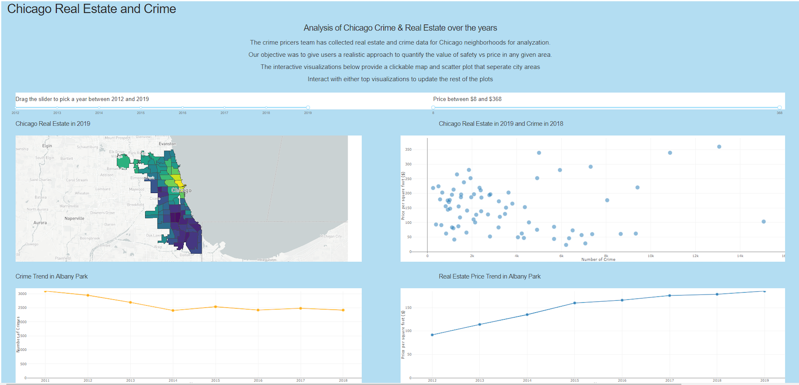
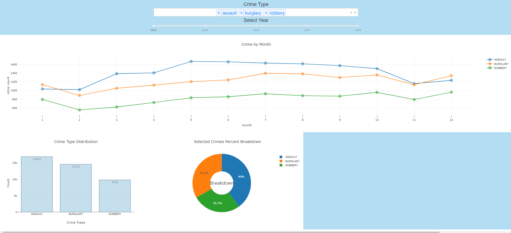

# cs418-project-crime-pricers

### RUN CRIME PRICERS INTERACTIVE APPLICATION
-------------------
Crime Pricers application for data analysis and interaction was created
using [Plotly Dash](https://plot.ly/dash)
To run the application you must have the following installed/downloaded

```
Python:

  python 3
  
python libraries:

     dash
     json
     plotly
     matplotlib.pyplot
     numpy
     panda
     csv
     feather
```

Local files:

```
    crimepricers.py
    CrimeApp directory with:
      Preprocess_Feather.py
      Utilities.py
    CrimeData.feather
    crime_community.feather
    chicago_communities.geojson
    ppsf.csv

```

Google Drive Shareable Link for local files:
[feather file on Google Drive](https://drive.google.com/drive/folders/1BS6PZmcE__zm3osqLRcJre1Fz6PjuC9L?usp=sharing)

----------------------------------------
### Using the demo

go to root directory containing crimepricers.py and run command on cmd line

> python crimepricers.py

this starts a local server for Dash app

NOTE: take the time to resolve any library conflicts
then proceed to open browser with local server ( May take a moment to load )


## Screenshots




